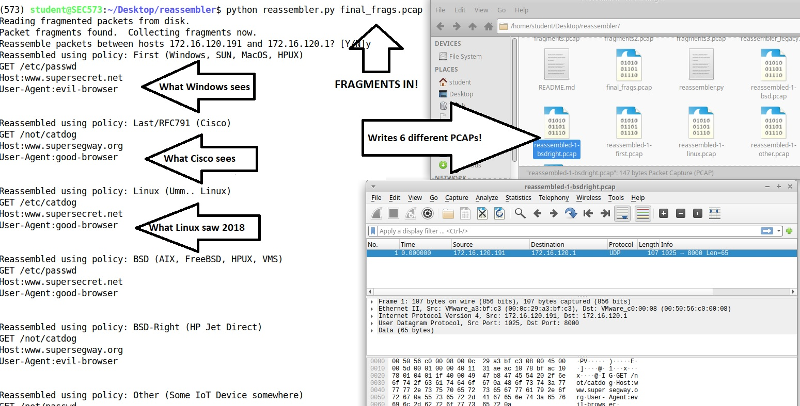

# reassembler
## A Python implementation of the various OS IPv4 packet fragment reassembly engines.

### One Packet in => Six Packets out

This module will reassemble fragmented packets using common used fragmentation reassembly techniques.  It then generates 6 pcap files. It also prints the payloads to the screen and shows you how each of the operating systems would see the packets after they reassemble them using their defragmentation engine.

This is a rewrite of the original released in 2012 to support Python3.
[Associated GIAC SANS Gold Paper](https://www.sans.org/reading-room/whitepapers/tools/ip-fragment-reassembly-scapy-33969)

---

### Are Overlapping fragments still an issue?

10-16-2020: [Don Williams](https://twitter.com/bashwrapper) and I did a survey of the major OSes to confirm the status of their reassembly engines. Here are the results:

 - [Linux](https://git.kernel.org/pub/scm/linux/kernel/git/torvalds/linux.git/commit/?id=c30f1fc041b74ecdb072dd44f858750414b8b19f) 
: The Linux OS's have begun silently ignoring overlapping IPv4 fragments. IPv6 rejects them by defalt.

 - [Windows](https://portal.msrc.microsoft.com/en-us/security-guidance/advisory/ADV180022): The posted "Fix" requires that you turn off ALL fragment reassembly, not just overlaps. It is not enabled by default.  I have been unable to get any Windows OS to respond to overlaps since Vista.

 - Macintosh: Tested on 10-16-2020 and it was still reassembling overlapping fragments without complaint.
 
---

### Installing

```pip install reassembler```

or

```pip install git+https://github.com/markbaggett/reassembler```

---

### Running

After pip install the command 'reassembler' is added to your path.

```
$ reassembler assemble ./sample_packets/final_frags.pcap 
```


or you can execute it as a python module

```
$ python -m reassembler
The first argument must by either "scan" or "assemble".
Try 'reassembler assemble -h' for help assembling fragmented packets. 
Try 'reassembler scan -h' for help. with the scanning host to identify their reassembly policy.
```


####  - assemble submenu
You can use reassembler to reassemble fragmented packet to and generate 6 individual PCAPS that show you what different reassembly policies would see.  For more details run ```reassembler assemble -h```

In its simplest form the tool is run like this:

```
(573) student@SEC573:~/Documents/pythonclass/reassembler$ reassembler assemble ./sample_packets/final_frags.pcap 
Reading fragmented packets from disk.
Packet fragments found.  Collecting fragments now.
Reassemble packets between hosts 172.16.120.191 and 172.16.120.1? [Y/N]y
Reassembled using policy: First (Windows*, SUN, MacOS*, HPUX)
GET /etc/passwd
Host:www.supersecret.net
User-Agent:evil-browser


Reassembled using policy: Last/RFC791 (Cisco)
GET /not/catdog
Host:www.supersegway.org
User-Agent:good-browser


Reassembled using policy: Linux (Linux prior to v5.8)
GET /etc/catdog
Host:www.supersecret.net
User-Agent:good-browser


Reassembled using policy: BSD (AIX, FreeBSD, HPUX, VMS)
GET /etc/passwd
Host:www.supersecret.net
User-Agent:good-browser


Reassembled using policy: BSD-Right (HP Jet Direct)
GET /not/catdog
Host:www.supersegway.org
User-Agent:evil-browser


Reassembled using policy: Other (Some IoT Device somewhere)
GET /not/passwd
Host:www.supersegway.org
User-Agent:evil-browser

(573) student@SEC573:~/Documents/pythonclass/reassembler$ ls *.pcap
reassembled-1-bsd.pcap       reassembled-1-first.pcap  reassembled-1-other.pcap
reassembled-1-bsdright.pcap  reassembled-1-linux.pcap  reassembled-1-rfc791.pcap
```

####  - scan submenu
You can use reassembler to scan a host and determine what reassembly policy it uses. Today reassembler identified 6 posible reassembly engine policies, but there are others.  For more details run ```reassembler scan -h```

Note: The scanner requires root privileges to craft packets. When installed, the reassembler binary is placed in the /bin directory of your Python installation.  Using 'sudo' changes which python interpreter you are using when running from a virtual machine.  To run reassembler from a virtual machine use the syntax shown here:

```
(573) student@SEC573:~/Documents/pythonclass/reassembler$ sudo -s "PATH=$PATH" reassembler scan 192.168.1.10/30
[sudo] password for student: 
Checking host 192.168.1.8:
  + 192.168.1.8 responded to a ping request! 
  + 192.168.1.8 is reassembling normal (non-overlapping) fragmented ping packets.
  + 192.168.1.8 is NOT responding to overlapping fragments ping packets.
  + Overlapping fragments ignored by 192.168.1.8
Checking host 192.168.1.9:
  + 192.168.1.9 responded to a ping request! 
  + 192.168.1.9 is reassembling normal (non-overlapping) fragmented ping packets.
  + 192.168.1.9 is NOT responding to overlapping fragments ping packets.
  + Overlapping fragments ignored by 192.168.1.9
Checking host 192.168.1.10:
  + 192.168.1.10 responded to a ping request! 
  + 192.168.1.10 is reassembling normal (non-overlapping) fragmented ping packets.
  + 192.168.1.10 is reassembling overlapping fragmented ping packets.
  + 192.168.1.10 responds with reassembly Linux
Checking host 192.168.1.11:
  + Can not ping 192.168.1.11.
```

---

### As a Module

```
>>> import reassembler
>>> reassembler.rfc791(reassembler.genjudyfrags())
<Ether  type=IPv4 |<IP  flags= frag=0 proto=icmp |<ICMP  type=echo-request code=0 id=0x0 seq=0x0 |<Raw  load='111111114444444444444444444444444444444422222222555555555555555555555555666666666666666666666666' |>>>>
>>> reassembler.first(reassembler.genjudyfrags())
<Ether  type=IPv4 |<IP  flags= frag=0 proto=icmp |<ICMP  type=echo-request code=0 id=0x0 seq=0x0 |<Raw  load='111111111111111111111111444444442222222222222222333333333333333333333333666666666666666666666666' |>>>>
>>> reassembler.linux(reassembler.genjudyfrags())
<Ether  type=IPv4 |<IP  flags= frag=0 proto=icmp |<ICMP  type=echo-request code=0 id=0x0 seq=0x0 |<Raw  load='111111111111111111111111444444444444444422222222555555555555555555555555666666666666666666666666' |>>>>
>>> reassembler.scan_host("192.168.1.1")
Checking host 192.168.1.1:
  + 192.168.1.1 responded to a ping request! 
  + 192.168.1.1 is reassembling normal (non-overlapping) fragmented ping packets.
  + 192.168.1.1 is NOT responding to overlapping fragments ping packets.
  + Overlapping fragments ignored by 192.168.1.1

```


---

